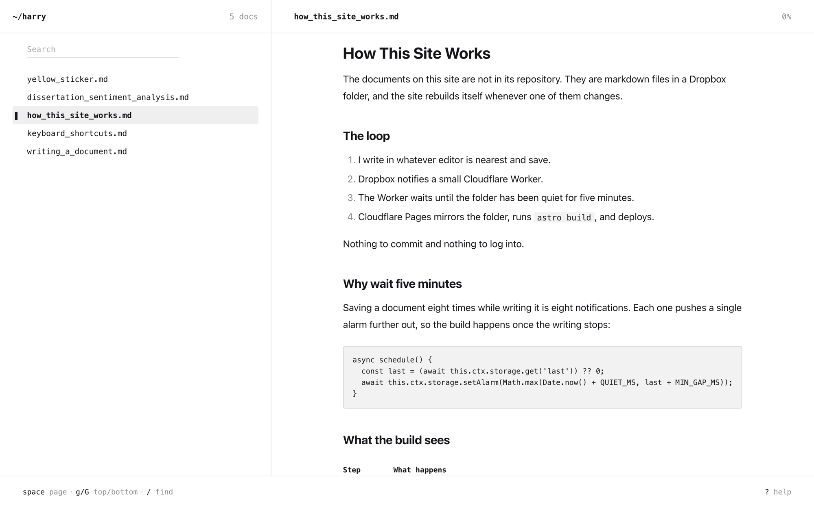
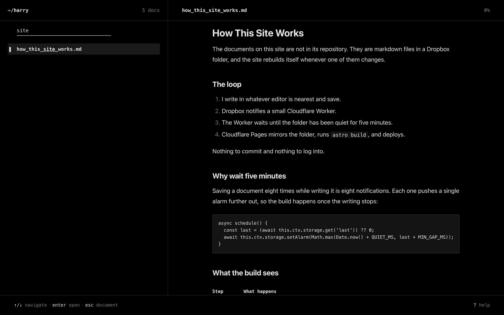
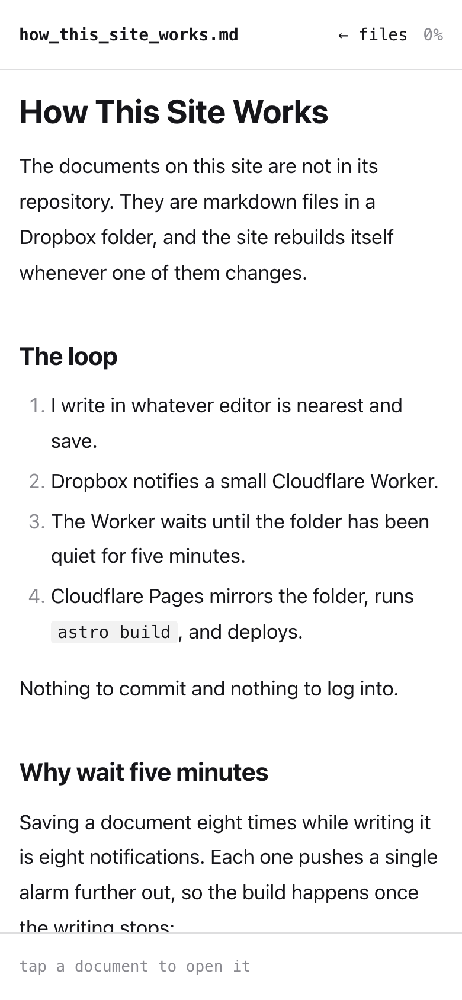
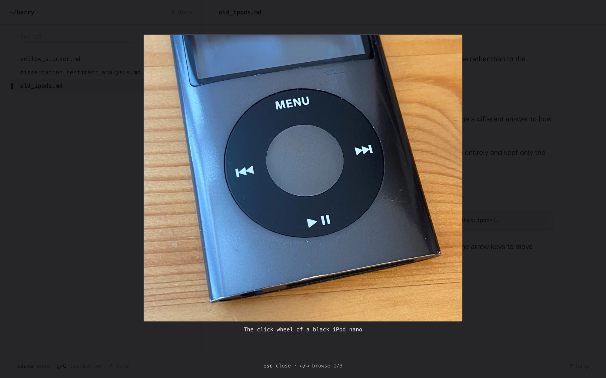

# harryisambard.dev

A terminal-inspired personal site that republishes itself whenever I save a
markdown file to Dropbox.

**Status:** live at [www.harryisambard.dev](https://www.harryisambard.dev). Still
being worked on.



## Why it exists

I wanted a loose portfolio and somewhere to write about projects in detail, and
I knew I would only keep it up if writing was frictionless. So the content is
not in this repository: I write markdown in whatever editor is nearest, on a
laptop or an iPad, save it to Dropbox, and the site rebuilds. Nothing to commit,
nothing to log into.

## What it does

- Shows a searchable list of documents on the left and the open document on the
  right, like `less` inside a file manager.
- Runs from the keyboard: `/` to search, `j`/`k` to move, `enter` to open,
  `space` to page, `?` for help.
- Rebuilds and redeploys when a file in the Dropbox folder changes, once the
  folder has been quiet for five minutes.
- Attaches photo sets to a phrase in the text: hover for thumbnails, click for a
  full-screen gallery.
- Follows the system light or dark theme, and stacks to one pane at a time on
  narrow screens.

<p>
  
  
</p>



## Technical highlights

- **Mirror, not loader.** A pre-build script copies the Dropbox folder into
  `src/content/` instead of fetching through an Astro content loader. Once the
  files are on disk, content collections and the image pipeline behave as they
  would for committed files, and nothing past that one script touches the network.
- **Cheap re-syncs.** The script computes Dropbox's own content hash locally
  (SHA-256 over the SHA-256 of each 4 MiB block) and skips files that already
  match. It also propagates deletions and stamps each file's mtime with
  Dropbox's timestamp so the list can sort by it.
- **Debounced builds.** Dropbox sends a webhook on every save. A Cloudflare
  Worker verifies the HMAC signature, then sets a single Durable Object alarm
  five minutes out; each new notification pushes it back. A document saved eight
  times causes one build, which matters on the Pages free plan's monthly build
  limit. A failed deploy hook is retried after a minute.
- **Builds that fail loudly.** Linking to a photo set that isn't declared in
  frontmatter fails the build and names the file and key. On Cloudflare Pages,
  missing Dropbox credentials fail the build rather than publishing an empty site.
- **Two panes, one keyboard.** The list and the pager are live at the same time
  and divide the keys by where focus is. The list persists across Astro view
  transitions, so the search text and cursor survive opening a document.

**Stack:** Astro (static output), one React island, hand-written CSS, Cloudflare
Pages, a Cloudflare Worker with a Durable Object, and the Dropbox API.

Built entirely with AI coding agents.

---

## Requirements

- Node.js 22.12 or newer
- Optional: a Dropbox app (app-folder access) to pull real content
- Optional: a Cloudflare account to deploy the site and the webhook Worker

## Setup

```sh
npm install
npm run dev
```

The site is served on `localhost:4321`.

The content folders (`src/content/files/` and `src/content/photos/`) are
gitignored, so a fresh clone starts with no documents. Without Dropbox
credentials the sync leaves whatever is on disk alone, so you can add markdown
files to `src/content/files/` by hand and work offline.

To pull content from Dropbox, copy `.env.example` to `.env` and fill in the
three values:

| Variable | Where it comes from |
| :--- | :--- |
| `DROPBOX_APP_KEY` | Dropbox app console → your app → Settings |
| `DROPBOX_APP_SECRET` | Same page |
| `DROPBOX_REFRESH_TOKEN` | The two steps below |

The app needs the `files.metadata.read` and `files.content.read` permissions.
Enable them before issuing the token: a token keeps the scopes it was made with.

1. Open this URL in a browser, approve the app, and copy the code it shows:

   ```
   https://www.dropbox.com/oauth2/authorize?client_id=<APP_KEY>&response_type=code&token_access_type=offline
   ```

2. Exchange the code. The `refresh_token` in the response is the value to keep:

   ```sh
   curl https://api.dropbox.com/oauth2/token \
     -u "<APP_KEY>:<APP_SECRET>" \
     -d grant_type=authorization_code \
     -d code=<CODE>
   ```

### Commands

| Command | Action |
| :--- | :--- |
| `npm run dev` | Sync, then serve on `localhost:4321` |
| `npm run sync` | Mirror the content down from Dropbox |
| `npm run build` | Sync, then build to `./dist/` |
| `npm run preview` | Serve the built site |
| `npm run deploy:hook` | Deploy the webhook Worker |

Both `dev` and `build` sync first, so local work starts from the same documents
the live site has. With credentials set, the sync is a mirror: it deletes local
files that are not in Dropbox.

## Writing a document

A markdown file in the Dropbox `files/` folder. The filename becomes the URL,
and `title` is the only required frontmatter:

```markdown
---
title: Yellow Sticker
updated: 2026-07-26
---

Yellow Sticker watches official box offices and pings you the second
same-day standing tickets appear for the shows you care about.
```

`updated` is optional. Without it the list sorts on the file's Dropbox
timestamp.

### Photos

Photos attach to a phrase, not a document, so a single file can have several
independent sets. Put the images in the Dropbox `photos/` folder, declare a set
in frontmatter, and reference it from the body with a `photos:` link:

```markdown
---
title: The Pier Rebuild
photos:
  scaffolding:
    - src: ../photos/pier-01.jpg
      alt: Scaffolding going up at low tide
---

The first weekend went entirely on [getting the frame up](photos:scaffolding).
```

That phrase shows thumbnails on hover and opens a full-screen gallery on click.
Thumbnails and full-size images are generated as WebP at build time. Referencing
a set that isn't declared fails the build; declaring one you never use warns.

## Keyboard

| Key | Action |
| :--- | :--- |
| `/` | Focus the search box |
| `↑` `↓` `j` `k` | Move the cursor in the list, or scroll the document |
| `enter` | Open the selected document |
| `space` `d` `u` | Page through the document |
| `g` `G` | Top / bottom |
| `esc` | Clear the search, then return to the document |
| `q` `←` | From a document, back to the list |
| `←` `→` | Browse photos in the gallery |
| `?` | Show the shortcuts |

Below 56rem the panes stack and show one at a time.

## How it works

```
  Any markdown editor, any device
          │ save
          ▼
  Dropbox app folder ──── webhook ────▶ Cloudflare Worker
          │                                    │ waits for five quiet minutes
          │                                    ▼
          │                             Pages deploy hook
          │                                    │
          │      build: mirror, then Astro     ▼
          └──────────────────────────▶ Cloudflare Pages ──▶ static site
```

Any deploy, whether from a code push or a Dropbox edit, publishes whatever is in
Dropbox at that moment.

### Project structure

| Path | Role |
| :--- | :--- |
| `src/layouts/Terminal.astro` | The two-pane shell: list, document, status bar |
| `src/pages/index.astro` | The list with no document open |
| `src/pages/[id].astro` | One route per document |
| `src/components/DocList.astro` | The searchable file list |
| `src/components/Help.astro` | The `?` shortcuts overlay |
| `src/components/PhotoLayer.tsx` | React island: photo popup and gallery |
| `src/scripts/find.ts` | Filtering and cursor movement in the left pane |
| `src/scripts/pager.ts` | `less`-style scrolling in the right pane |
| `src/lib/docs.ts` | The only module that talks to `astro:content` |
| `src/lib/photos.ts` | Builds thumbnails and full-size images for photo sets |
| `src/plugins/rehype-photo-links.mjs` | Turns `photos:` links into gallery triggers |
| `scripts/sync-content.mjs` | Dropbox → `src/content/` |
| `worker/index.js` | Dropbox webhook → debounced Pages build |

## Tests

```sh
npm test
```

[Vitest](https://vitest.dev) runs everything, in three groups set up in
`vitest.config.mjs`. None of them touch the network, the real `.env` or
`src/content/`.

| Tests | Cover | Run in |
| :--- | :--- | :--- |
| `tests/sync/` | The Dropbox hash, the API calls, which files are downloaded, restamped or removed, and what happens without credentials | Node, against a fake Dropbox and a scratch folder |
| `tests/plugins/` | The `photos:` link rewrite, its build error and its warning | Node |
| `tests/scripts/` | Filtering, the cursor, and which pane a key goes to | jsdom, on a cut-down copy of the page |
| `tests/worker/` | The signature check, the challenge echo, and the build scheduler's quiet window, minimum gap and retry | The Workers runtime, via `@cloudflare/vitest-pool-workers` |

To run one group or one file:

```sh
npx vitest run --project worker
npx vitest run tests/scripts/find.test.ts
```

The React photo popup and gallery, the Astro templates and the stylesheets have
no tests; `npx astro build` is the check that they still compile.

## Deployment

Cloudflare Pages builds from `main` with `npm run build` and publishes `dist`.
The three Dropbox variables are set in the Pages environment, for Production and
Preview both.

The Worker is deployed separately and holds two secrets of its own: the Dropbox
app secret, to verify notifications, and the Pages deploy hook URL.

```sh
npx wrangler secret put DROPBOX_APP_SECRET -c worker/wrangler.jsonc
npx wrangler secret put PAGES_DEPLOY_HOOK -c worker/wrangler.jsonc
npm run deploy:hook
```

Its URL then goes in the Webhooks section of the Dropbox app console.

## Tests

There are none yet, and no lint or type-check script. Adding tests is the next
planned piece of work.

## Known limitations

- A Dropbox edit takes at least five minutes to go live, plus the build.
- Search matches filenames and titles, not document text.
- Only files directly inside `files/` and `photos/` are synced; subfolders are
  ignored.
- The dev server does not watch Dropbox. Rerun `npm run sync` to pick up an edit
  made elsewhere mid-session.
- Code blocks are not syntax highlighted. This is deliberate, as the document
  pane is single-colour.
- The repository has no licence file.

## Built with

- [Astro](https://astro.build) and [React](https://react.dev)
- [Floating UI](https://floating-ui.com) for the photo popup positioning
- [unist-util-visit](https://github.com/syntax-tree/unist-util-visit) in the
  `photos:` link plugin
- [Cloudflare Pages](https://pages.cloudflare.com) and
  [Workers](https://workers.cloudflare.com) with Durable Objects
- The [Dropbox API](https://www.dropbox.com/developers/documentation/http/overview)
